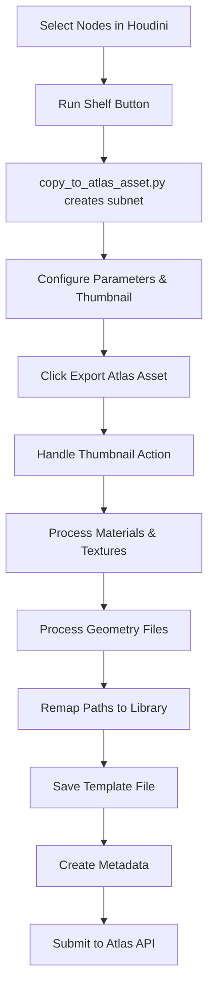

# Blacksmith Atlas - Houdini Integration (houdiniae.py) Understanding Guide

## Overview

The `houdiniae.py` file is the core Houdini integration module for Blacksmith Atlas. It provides a template-based asset export system that preserves Houdini node networks perfectly using Houdini's native `saveChildrenToFile` and `loadChildrenFromFile` methods.

## Core Architecture

### 1. TemplateAssetExporter Class

The main class that handles the entire asset export process from Houdini to the Atlas library.

#### Key Properties
- **asset_name**: Human-readable name of the asset
- **asset_id**: 14-character unique identifier (9 base + 2 variant + 3 version)
- **subcategory**: Asset classification (e.g., "Blacksmith Asset", "Megascans")
- **asset_type**: Top-level category (Assets, FX, Materials, HDAs)
- **render_engine**: Target renderer (Redshift, Karma, etc.)
- **action**: Operation type (create_new, variant, version_up)

#### Asset ID Structure
```
XXXXXXXXX AA 001
    |      |   |
    |      |   └── Version number (3 digits)
    |      └────── Variant ID (2 letters: AA-ZZ)
    └───────────── Base UID (9 characters)
```

### 2. Asset Export Workflow



### 3. Current File Architecture

The system now uses a dual-file approach:

#### Primary Workflow Files
- **`copy_to_atlas_asset.py`**: Main entry point, parameter creation, UI
- **`houdiniae.py`**: Core TemplateAssetExporter class, export logic

#### Legacy/Alternative Files (Not Used)
- **`shelf_create_atlas_asset.py`**: Alternative shelf tool (legacy)
- **`tools/shelf_create_atlas_asset.py`**: Original shelf module (legacy)

### 4. Thumbnail System Architecture

The thumbnail system provides three distinct workflows:

#### Automatic Thumbnail (Default)
- **Process**: Loads render farm HDA → Configures → Executes dl_Submit
- **File**: Uses `atlas_config.houdini_hda_path`
- **Method**: `load_and_configure_render_hda()` + `auto_execute_dl_submit()`
- **Output**: Farm-rendered thumbnail sequence

#### Choose Thumbnail (Custom)
- **Process**: User selects file/sequence → Copies to thumbnail folder
- **Method**: `copy_custom_thumbnail()`
- **Supports**: PNG, JPG, EXR, sequences, UDIM patterns
- **Output**: Copied files in asset's thumbnail folder

#### Disable Thumbnail (Text-based)
- **Process**: Generates text-based thumbnail with asset name
- **Method**: `create_text_thumbnail()`
- **Fallback**: Creates info text file if PIL unavailable
- **Output**: 512x512 PNG with styled text

## Key Methods Explained

### `export_as_template()`
Main export method that orchestrates the entire process:
1. Creates asset folder structure in library
2. Detects BGEO sequences for proper handling
3. Processes materials and textures
4. Processes geometry files
5. **Remaps all file paths from job locations to library locations**
6. Saves Houdini template file using `saveChildrenToFile`
7. Creates comprehensive metadata
8. Submits asset to Atlas API

### `process_materials_and_textures()`
Comprehensive texture scanning system:
- Recursively scans all nodes in the subnet
- Finds VOP nodes (shader networks) and SHOP materials
- Extracts texture parameters from all material nodes
- **Handles UDIM patterns** (e.g., `texture.<UDIM>.png`)
- Copies textures organized by material name
- Returns texture info with preserved patterns

### `process_geometry_files()`
Geometry file detection and handling:
- Scans for File Cache SOPs, File SOPs, Alembic ROPs
- **Detects BGEO sequences** with frame variables (${F4})
- Handles various formats: .bgeo, .obj, .fbx, .abc, .usd
- Preserves frame patterns for sequences
- Organizes files by type in Geometry folder

### `remap_paths_before_export()`
Critical path remapping before template save:
```python
# Example remapping:
# FROM: /net/jobs/project/textures/wood.jpg
# TO:   /net/library/atlaslib/3D/Assets/BlacksmithAssets/ASSET_ID/Textures/Material/wood.jpg
```

This ensures the template file contains library paths, not job paths!

### `detect_bgeo_sequences_early()`
Special handling for BGEO sequences:
- Detects patterns like `sim_${F4}.bgeo.sc`
- Preserves frame variables during remapping
- Maps pattern-to-pattern, not individual files

## File Organization

### Library Structure
```
/net/library/atlaslib/3D/
└── Assets/
    └── BlacksmithAssets/
        └── 9CHAR_AA001/                    # Asset folder (14-char ID)
            ├── template_redshift.hip        # Houdini template file
            ├── metadata.json                # Asset metadata
            ├── Data/
            │   └── paths.json              # Path mappings record
            ├── Textures/
            │   ├── MaterialName1/          # Organized by material
            │   │   ├── diffuse.jpg
            │   │   ├── normal.png
            │   │   └── rough.<UDIM>.png   # UDIM sequences preserved
            │   └── MaterialName2/
            │       └── ...
            └── Geometry/
                ├── OBJ/
                │   └── model.obj
                ├── FBX/
                │   └── model.fbx
                └── Other/
                    └── sim_${F4}.bgeo.sc  # Frame sequences preserved
```

## Special Pattern Handling

### UDIM Textures
```python
# Original: /job/textures/brick.<UDIM>.png
# Library: /library/.../Textures/Material/brick.<UDIM>.png

# The system:
1. Detects <UDIM> pattern
2. Finds all actual files (.1001, .1002, etc.)
3. Copies all individual files
4. But preserves <UDIM> in path mappings
5. Parameters updated with pattern intact
```

### BGEO Sequences
```python
# Original: /job/sim/fluid_${F4}.bgeo.sc
# Library: /library/.../Geometry/Other/fluid_${F4}.bgeo.sc

# The system:
1. Detects ${F4} or ${F} patterns
2. Uses unexpandedString() to preserve variables
3. Maps pattern-to-pattern
4. Frame variables remain in template
```

## Path Remapping Process

### 1. Build Path Mappings
Collects all file references that need remapping:
- Texture paths from materials
- Geometry paths from SOPs
- Any file parameters in nodes

### 2. Apply Remappings
Updates all node parameters before saving template:
```python
# For each parameter with file path:
if unexpanded_value in path_mappings:
    # Use unexpanded for patterns (preserves ${F4}, <UDIM>)
    parm.set(path_mappings[unexpanded_value])
elif current_value in path_mappings:
    # Use evaluated value for regular files
    parm.set(path_mappings[current_value])
```

### 3. Save Template
After remapping, saves the subnet with library paths using:
```python
parent_node.saveChildrenToFile(nodes_to_export, network_boxes, template_file)
```

## Metadata Structure

The system creates comprehensive metadata for each asset:

```json
{
    "id": "9CHAR_AA001",
    "name": "Asset Name",
    "category": "Blacksmith Asset",
    "asset_type": "Assets",
    "dimension": "3D",
    "metadata": {
        "houdini_version": "20.5.445",
        "template_file": "template_redshift.hip",
        "export_metadata": {
            "exported_at": "2024-01-15T10:30:00",
            "exported_by": "artist.name",
            "render_engine": "Redshift"
        },
        "textures": {
            "count": 15,
            "files": ["diffuse.jpg", "normal.<UDIM>.png"],
            "mapping": {
                "tex_001": {
                    "material": "wood_mat",
                    "original_path": "/job/tex/wood.jpg",
                    "library_path": "Textures/wood_mat/wood.jpg"
                }
            }
        },
        "geometry_files": {
            "count": 5,
            "files": ["model.obj", "sim_${F4}.bgeo.sc"],
            "mapping": {
                "geo_001": {
                    "node_path": "/obj/subnet/filecache1",
                    "original_path": "/job/geo/sim_${F4}.bgeo.sc",
                    "library_path": "Geometry/Other/sim_${F4}.bgeo.sc",
                    "is_pattern_mapping": true
                }
            }
        }
    }
}
```

## Import Process

### `import_atlas_asset()`
Reconstructs assets from library:
1. Loads metadata from selected asset
2. Creates subnet in current context
3. Loads template using `loadChildrenFromFile`
4. Remaps paths from library to current location
5. Sets up thumbnail display

### Path Remapping on Import
Similar to export, but in reverse:
- Library paths → Current hip file location
- Preserves patterns during remapping
- Handles both textures and geometry

## Error Handling

The system includes comprehensive error handling:
- File existence validation
- API connection failures
- Missing dependencies
- Path resolution issues
- Pattern preservation verification

## Best Practices

### 1. Asset Preparation
- Organize nodes cleanly before export
- Use clear material names
- Ensure all file paths are valid
- Test render before export

### 2. Naming Conventions
- Use descriptive asset names
- Material folders use material node names
- Preserve original filenames where possible
- Patterns (<UDIM>, ${F4}) maintained exactly

### 3. Version Control
- **create_new**: New asset (version 001)
- **version_up**: Increment version (001→002)
- **variant**: New variant (AA→AB)

## Performance Optimizations

### Efficient Scanning
- Single recursive pass through node tree
- Batch file operations
- Minimal API calls
- Cached path lookups

### Memory Management
- Streams large files during copy
- Cleans up temporary data
- Limits preview image sizes

## Integration Points

### 1. Shelf Tools
- Create Atlas Asset button
- Import Atlas Asset button
- Quick export shortcuts

### 2. API Communication
- RESTful endpoints
- JSON data exchange
- Async submission support

### 3. File System
- Network path resolution
- Cross-platform compatibility
- Permission handling

## Debugging Features

### Console Output
Comprehensive logging throughout:
```
🚀 TEMPLATE EXPORT: Asset Name
📂 Target: /net/library/atlaslib/3D/...
🔍 Scanning for materials and textures...
🎯 UDIM PATTERN DETECTED - preserving pattern...
✅ Path remapping complete: 45 paths updated
```

### Path Mapping Verification
- Original vs library path logging
- Pattern preservation checks
- Missing file warnings

## Future Enhancements

### Planned Features
1. USD/Solaris support
2. Houdini Engine integration
3. Batch export capabilities
4. Dependency tracking
5. Asset relationships

### Performance Improvements
1. Parallel file copying
2. Incremental updates
3. Smart caching
4. Compression options

---

This documentation reflects the current state of the Houdini integration system. The template-based approach ensures perfect reconstruction of assets while the comprehensive path remapping system maintains all file references correctly in the library structure.